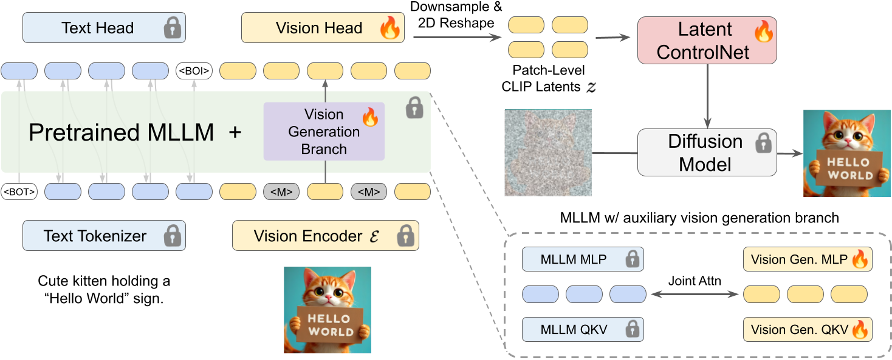

# Bifrost-1: Bridging Multimodal LLMs and Diffusion Models with Patch-level CLIP Latents

Official implementation of **Bifrost-1**, a unified framework that bridges pretrained multimodal LLMs (MLLMs) and diffusion models using patch-level CLIP image embeddings as implicit 2D image priors, which are natively aligned with the MLLM’s CLIP visual encoder. 


[](https://arxiv.org/abs/2404.09967) 
[](https://ctrl-adapter.github.io/)
[](https://huggingface.co/hanlincs/Bifrost-1)


[Han Lin](https://hl-hanlin.github.io/),
[Jaemin Cho](https://j-min.io),
[Amir Zadeh](https://scholar.google.com/citations?user=MQFngiMAAAAJ&hl=en),
[Chuan Li](https://scholar.google.com/citations?user=hoZesOwAAAAJ&hl=en),
[Mohit Bansal](https://www.cs.unc.edu/~mbansal/)


<br>

<br>


# 🔧 Environment Setup

```shell
conda create -n bifrost1 python==3.11
conda activate bifrost1
pip install -r requirements.txt
```


# 🔮 Inference

### 📌 Model Checkpionts

The model checkpoint can be download from HuggingFace [here](https://huggingface.co/hanlincs/Bifrost-1).

You can download it to your specified `local_dir` with code:
```
from huggingface_hub import snapshot_download

snapshot_download(
    repo_id="hanlincs/Bifrost-1",
    repo_type="model",
    local_dir="xxxxxxxx",
    local_dir_use_symlinks=False  
)
```


### 📌 Run Inference Scripts

Generate images from GenEval prompts

```
python inference_geneval_dpgbench.py --eval_geneval --output_dir "./outputs" --local_checkpoint_path XXXXX
```

Generate images from DPGBench prompts

```
python inference_geneval_dpgbench.py --eval_dpgbench --output_dir "./outputs" --local_checkpoint_path XXXXX
```


# 📚 BibTeX

🌟 Please let us know in the issues or PRs if there's any questions. If you find our project useful in your research or application development, citing our paper would be the best support for us! 

```
```

# 🙏 Acknowledgements
The development of Bifrost-1 has been greatly inspired by the following amazing works and teams:

- [BLIP3o](https://github.com/JiuhaiChen/BLIP3o)
- [Qwen2.5-VL](https://github.com/QwenLM/Qwen2.5-VL)
- [FLUX.1-dev](https://huggingface.co/black-forest-labs/FLUX.1-dev)

We hope that releasing this model/codebase helps the community to continue pushing these creative tools forward in an open and responsible way.
